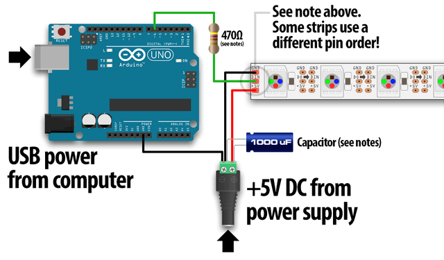
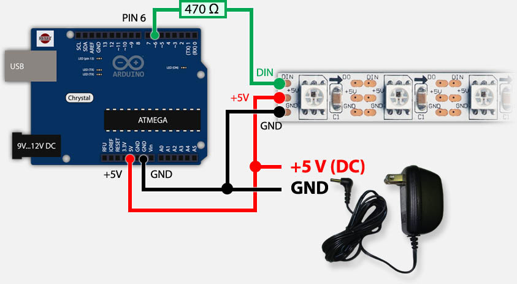

# LED_box
The [LED box](https://ntnu.box.com/s/54gfmdsg4xefp7i1zyaw3o8i6tqbxnvq) is used as a showpiece for visualizing live MEA/neural data from the NTNU Cyborg. The box is a cube of opal acrylic plates containing 240 individually controlled ws2812b RGB-LEDs controlled by an Arduino Mega.

  
   
  

## Prerequisites
Using [FastLED](https://github.com/FastLED/FastLED) library to control ws2812b LEDs.

## Schematic
Connecting the Arduino Mega to the ws2812b LED strip:

Powering the Arduino using a 5V power supply:

